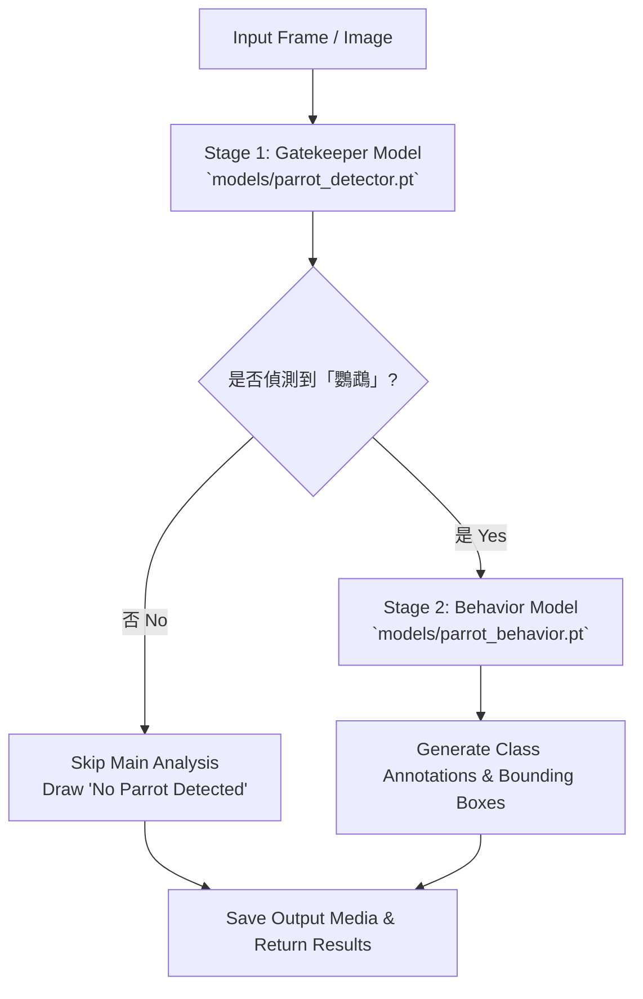

# Parrot Recognition & Object Detection System (YOLOv8 + Gradio)

A modular, PEP 8-compliant Python application for parrot recognition and behavior detection using **YOLOv8** and **Gradio**.

---

## 🏗️ Architecture & Pipeline Flow

The system employs a two-stage detection pipeline with a custom gatekeeper model (`parrot_detector.pt`) to verify parrot presence before triggering the fine-tuned behavior model (`parrot_behavior.pt`).



---

## 📁 Directory Structure

```text
.
├── models/
│   ├── parrot_detector.pt     # Stage 1: Custom Gatekeeper Model (Class ID 0 "parrot")
│   └── parrot_behavior.pt     # Stage 2: Fine-tuned Pacific Parrotlet Behavior Model
├── media/
│   ├── input/                  # Input image and video test files
│   │   ├── napping_image.jpg
│   │   └── eating_video.mp4
│   └── output/                 # Generated detection outputs
│       ├── result_napping_image.jpg
│       └── result_eating_video.mp4
├── src/
│   ├── __init__.py
│   ├── detector.py            # Core two-stage YOLOv8 inference class (ParrotDetector)
│   └── utils.py               # Helper utility functions (scaling, paths, formatting)
├── app.py                     # Gradio web interface entry point
├── detect.py                  # Command-line interface (CLI) entry point
├── requirements.txt           # Project dependencies
└── README.md                  # Project documentation
```

---

## 🚀 Installation & Setup

1. **Clone the repository** and navigate to the project directory:
   ```bash
   git clone <repository_url>
   cd parrot-detection
   ```

2. **Install dependencies**:
   ```bash
   pip install -r requirements.txt
   ```

---

## 💻 CLI Execution (`detect.py`)

Run object detection locally via the command-line interface.

### Options:
- `--mode`: `image` or `video` (default: `image`)
- `--source`: Path to input image/video file (default: `media/input/napping_image.jpg`)
- `--weights`: Path to behavior model weights (default: `models/parrot_behavior.pt`)
- `--gatekeeper`: Path to gatekeeper model weights (default: `models/parrot_detector.pt`)
- `--conf`: Confidence threshold (default: `0.5`)
- `--scale`: OpenCV preview window scale factor for video (default: `0.5`)
- `--show`: Optional flag to open local OpenCV preview window

### Examples:

- **Image Inference**:
  ```bash
  python detect.py --mode image --source media/input/napping_image.jpg --conf 0.5
  ```

- **Video Inference**:
  ```bash
  python detect.py --mode video --source media/input/eating_video.mp4 --conf 0.5
  ```

Outputs are automatically saved to `media/output/`.

---

## 🌐 Gradio Web Interface (`app.py`)

Launch the web application with interactive tabs for Image and Video analysis:

```bash
python app.py
```

Access the interface in your web browser at `http://localhost:7860`.

### Features:
- **Image Analysis Tab**: Displays annotated image alongside detected class names and confidence scores formatted as percentages (e.g. `Parrot: 97.89%`).
- **Video Analysis Tab**: Processes uploaded videos, saves output to `media/output/`, and provides preview and download capabilities.

---

## ⚙️ Module Design (`src/`)

- `src/detector.py`: Contains `ParrotDetector` class. Implements a two-stage detection logic:
  1. **Gatekeeper Stage (`_has_parrot`)**: Checks for parrot presence using `models/parrot_detector.pt` (custom dataset class ID 0).
  2. **Behavior Analysis Stage**: If a parrot is detected, runs the fine-tuned `models/parrot_behavior.pt` model to recognize parrot behaviors. If no parrot is detected, overlaying `"No Parrot Detected"` onto the output media is performed without invoking the main model.
- `src/utils.py`: Provides helper utilities for path handling, image/frame scaling (`scale=0.5`), and detection dictionary/text formatting.
