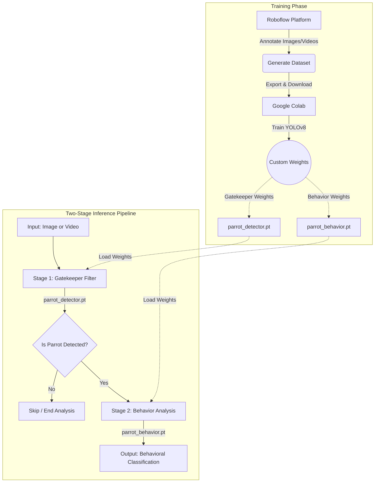

# Pacific Parrotlet Behavior Detector

A modular Python app using YOLOv8 and Gradio to recognize Pacific Parrotlets and detect 13 distinct behaviors.

---



### Key Features

- **Two-Stage Pipeline**: Uses `parrot_detector.pt` as a Stage 1 gatekeeper to filter out non-parrot scenes before invoking `parrot_behavior.pt`, optimizing system efficiency.
- **13 Behavior Classes**: Fine-tuned specifically to detect Pacific Parrotlet actions.
- **Web UI & CLI**: Supports interactive web analysis via Gradio and scriptable command-line processing.

### Supported Behaviors (13 Classes)

The model is trained to recognize the following 13 distinct Pacific Parrotlet behaviors:

| Category | Behaviors |
| :--- | :--- |
| **Feeding & Maintenance** | `beak wiping`, `drinking`, `eating`, `gnawing`, `head rubbing`, `preening` |
| **Activity & States** | `excited`, `exploring`, `observing`, `relaxed`, `stretching` |
| **Rest & Sleep** | `napping`, `sleeping` |

### Project Structure
```text
├── media/
│   ├── input/             # Default sample images and videos
│   └── output/            # Saved detection outputs
├── models/
│   ├── parrot_detector.pt # Stage 1 gatekeeper model weights
│   └── parrot_behavior.pt # Stage 2 behavior classification weights
├── src/
│   ├── detector.py        # Core YOLOv8 two-stage inference logic
│   └── utils.py           # Frame formatting and H.264 re-encoding utilities
├── app.py                 # Gradio Web Interface
├── detect.py              # Command-Line Interface (CLI)
└── requirements.txt
```

### Live Demo & Training
- **Live Interactive Demo**: Experience the web UI online via [Hugging Face Spaces](https://huggingface.co/spaces/Chou1210/pacific-parrotlet-behavior-detector).

- **Model Training Notebook**: Train or fine-tune the YOLOv8 model directly on [Google Colab](https://colab.research.google.com/drive/1qwhsvbD7bXQEISDe8S1wx_ehuNlAO3by?usp=drive_link)

### Quick Start
#### Web Interface (Gradio)
Launch the interactive web application:

```bash
python app.py
```

#### Command Line Interface (CLI)

Run inference directly from the terminal using `detect.py`.

#### CLI Arguments

| Parameter | Type | Default | Description |
| :--- | :--- | :--- | :--- |
| `--mode` | str | `image` | Inference mode: `image` or `video`. |
| `--source` | str | `media/input/napping_image.jpg` | Path to image/video or camera index (e.g., `0`). |
| `--weights` | str | `models/parrot_behavior.pt` | Path to main behavior model weights. |
| `--gatekeeper` | str | `models/parrot_detector.pt` | Path to gatekeeper detector weights. |
| `--conf` | float | `0.5` | Confidence threshold for detection. |
| `--scale` | float | `0.5` | Display scaling factor for video preview window. |
| `--show` | flag | `False` | Display OpenCV GUI window during processing. |

#### Real-Time Webcam Detection

To perform live real-time detection via webcam, set the input source to `0` and pass the `--show` flag:

```bash
python detect.py --mode video --source 0 --show
```

#### Image & Video File Analysis

```bash
# Analyze a single image
python detect.py --mode image --source media/input/napping.jpg --conf 0.5

# Process a video file with live preview
python detect.py --mode video --source media/input/compilation_video.mp4 --show
```
