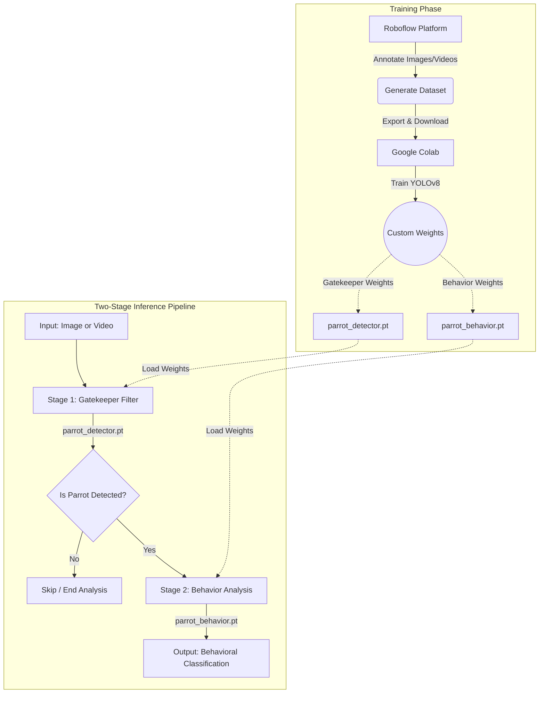

# Pacific Parrotlet Behavior Detector

A modular Python application using YOLOv8 and Gradio to recognize Pacific Parrotlets and detect 13 distinct behaviors in images and videos.

---

### System Architecture Workflow



---

### Key Features

- **Two-Stage Inference Pipeline**: Uses `parrot_detector.pt` as a Stage 1 gatekeeper model to filter out non-parrot scenes before invoking `parrot_behavior.pt`, optimizing system performance and inference efficiency.
- **13 Behavioral Classes**: Fine-tuned specifically to classify Pacific Parrotlet actions and postures.
- **Web UI & CLI Interfaces**: Features an interactive web interface powered by Gradio alongside a command-line script (`detect.py`).

---

### Supported Behaviors (13 Classes)

The main behavior model is fine-tuned to recognize the following 13 distinct Pacific Parrotlet behaviors:

| Category | Behaviors |
| :--- | :--- |
| **Feeding & Maintenance** | `beak wiping`, `drinking`, `eating`, `gnawing`, `head rubbing`, `preening` |
| **Activity & States** | `excited`, `exploring`, `observing`, `relaxed`, `stretching` |
| **Rest & Sleep** | `napping`, `sleeping` |

---

### Project Structure
```text
.
├── media/
│   ├── input/             # Sample images and videos for testing
│   └── output/            # Generated detection outputs and annotated media
├── models/
│   ├── parrot_detector.pt # Stage 1 gatekeeper model weights
│   └── parrot_behavior.pt # Stage 2 behavior classification weights
├── src/
│   ├── __init__.py
│   ├── detector.py        # Core YOLOv8 two-stage inference logic
│   └── utils.py           # Path management, formatting, and H.264 video encoding
├── app.py                 # Gradio Web Application (Entry point)
├── detect.py              # Command-Line Interface (CLI)
├── README.md              # Project documentation
└── requirements.txt       # Python dependencies
```

---

### Live Demo & Model Training
- **Interactive Live Demo**: Try the web UI online via [Hugging Face Spaces](https://huggingface.co/spaces/Chou1210/pacific-parrotlet-behavior-detector).
- **Model Training Notebook**: View or run the YOLOv8 fine-tuning workflow on [Google Colab](https://colab.research.google.com/drive/1qwhsvbD7bXQEISDe8S1wx_ehuNlAO3by?usp=drive_link).

---

### Installation & Quick Start

#### 1. Setup Environment
Ensure Python 3.9+ is installed, then install required dependencies:

```bash
pip install -r requirements.txt
```

#### 2. Launch Web Interface (Gradio)
Start the web application:

```bash
python app.py
```

Open `http://localhost:7860` in your browser.

#### 3. Command Line Interface (CLI)
Run inference directly from your terminal using `detect.py`:

```bash
# Analyze a single image
python detect.py --mode image --source media/input/napping.jpg --conf 0.5

# Process a video file with progress updates
python detect.py --mode video --source media/input/compilation_video.mp4 --conf 0.5

# Real-time webcam inference (press 'q' to exit preview window)
python detect.py --mode video --source 0 --show
```